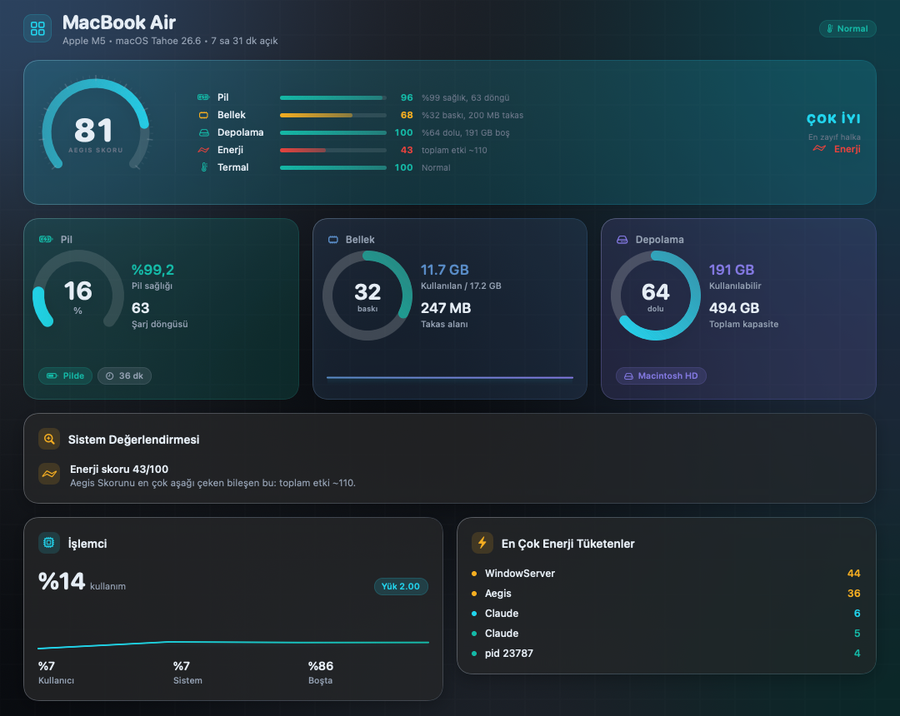
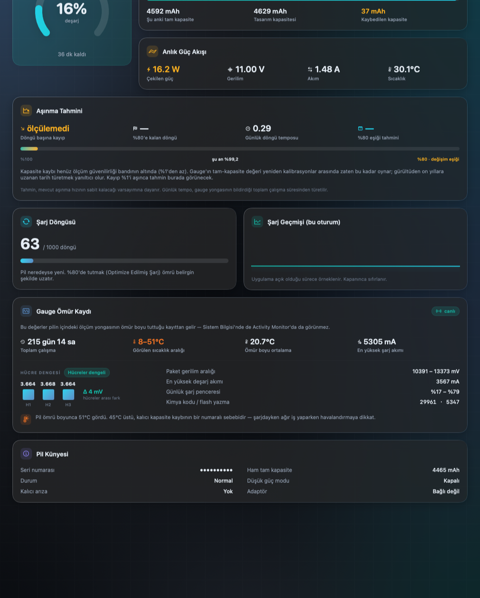
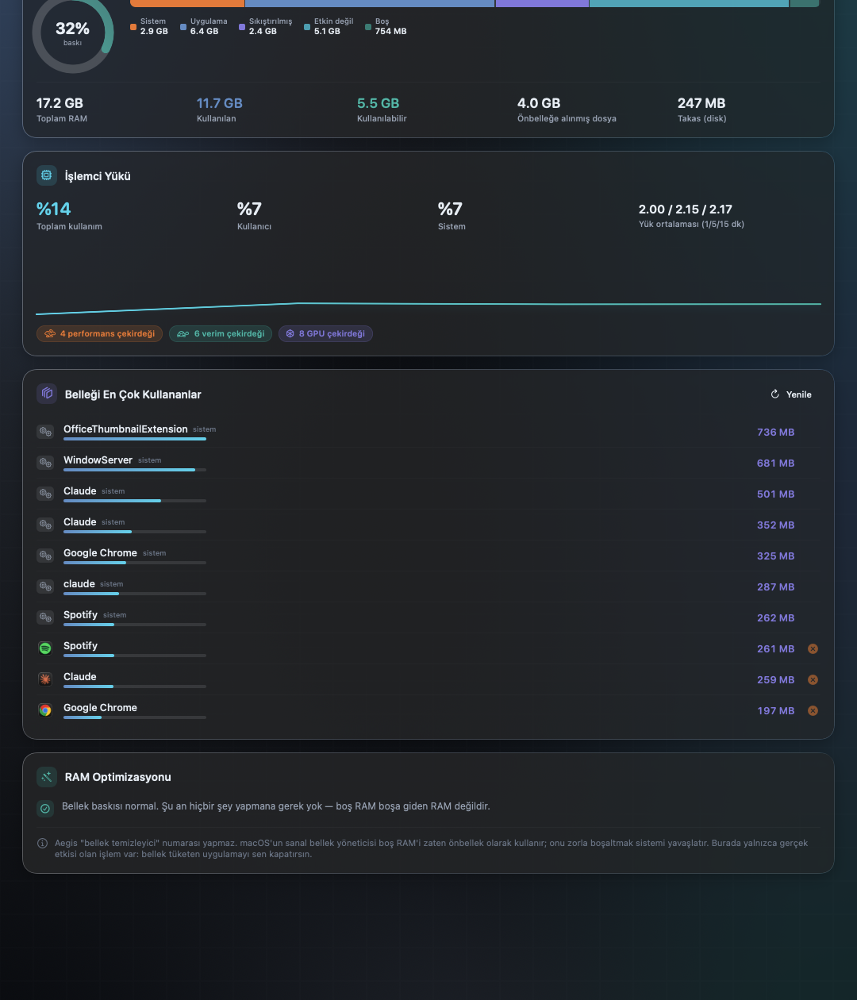
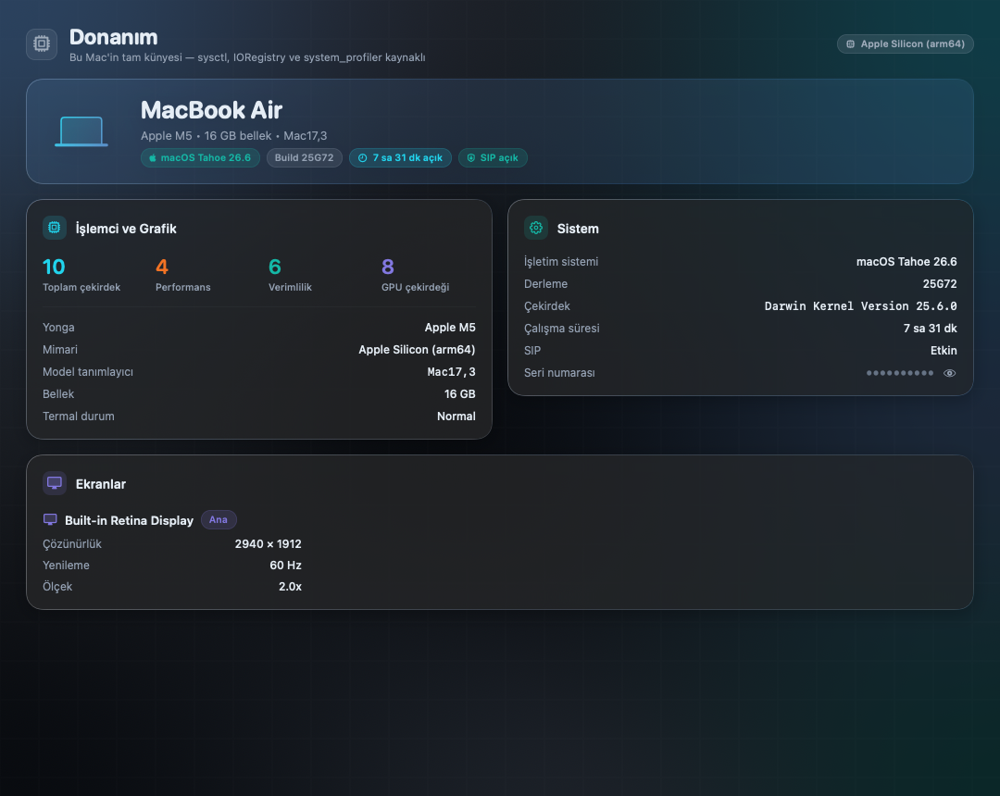

# Aegis — Mac Kontrol Merkezi

[English](README.md) | **Türkçe**

macOS 26 (Tahoe) için tek çatı altında sistem denetimi: pil sağlığı ve döngü,
donanım künyesi, bellek/işlemci telemetrisi, enerji tüketen süreçler, depolama
analizi, güvenli temizlik ve başlangıç öğesi denetçisi.

Native SwiftUI + Liquid Glass. Dış bağımlılık yok, arka plan servisi yok,
ağ erişimi yok, yükseltilmiş yetki yok.

> **Sorumluluk reddi:** Aegis dosyaları yalnızca Çöp Kutusu'na taşır ve çok
> katmanlı bir güvenlik kapısından geçirir; yine de yazılım "olduğu gibi",
> hiçbir garanti olmadan sunulur (bkz. [LICENSE](LICENSE)). Temizlik
> sonuçlarını onaylamadan önce listeyi gözden geçir.



<details>
<summary><b>Daha fazla ekran görüntüsü</b> — Pil (gauge ömür kaydı, hücre dengesi), Performans, Donanım</summary>
<br>







</details>

---

## Kurulum

Hazır ikili dağıtılmaz — uygulamayı kendi makinende kaynaktan derlersin.
Bu bilinçli bir tercih: imzasız ikili indirtmek yerine, ne çalıştırdığını
görebileceğin ~6.400 satırlık kaynak derlenir. Kendi derlediğin uygulama
Gatekeeper uyarısı da üretmez.

Gereksinim: macOS 26 (Tahoe) ve Xcode 26 (ya da Command Line Tools).

```bash
git clone https://github.com/yavuzhankursun/Aegis.git
cd Aegis
./build_app.sh release       # derler, .app paketler, simge üretir, ad-hoc imzalar
open build/Aegis.app
```

Uygulamayı `/Applications` altına taşımak istersen:

```bash
cp -R build/Aegis.app /Applications/
```

**Tam Disk Erişimi (isteğe bağlı):** Depolama ve Temizlik sekmelerinin bazı
klasörleri okuyabilmesi için Sistem Ayarları → Gizlilik ve Güvenlik →
Tam Disk Erişimi listesine Aegis'i eklemen gerekebilir. Erişim yoksa uygulama
çökmez; okuyamadığı yerleri sessizce atlar ve toplamlara dahil etmez.

---

## Sekmeler

| Sekme | Ne yapar |
|---|---|
| **Genel Bakış** | Aegis Skoru, pil/bellek/depolama özeti, sistem değerlendirmesi |
| **Pil** | Sağlık, döngü, anlık güç akışı, aşınma tahmini, gauge ömür kaydı, hücre dengesi |
| **Performans** | Bellek dağılımı, baskı, takas, işlemci yükü, RAM tüketen uygulamalar |
| **Enerji** | macOS'un kendi Energy Impact ölçümüyle süreç sıralaması |
| **Depolama** | Birim doluluk, kullanıcı klasörlerinin gerçek boyutu |
| **Temizlik** | Önbellek/günlük/derleme çıktısı taraması ve Çöp Kutusu'na taşıma |
| **Başlangıç** | Launch agent / daemon denetçisi, hayalet ajan tespiti |
| **Donanım** | Yonga, çekirdek dağılımı, GPU, ekran, SIP, seri numarası |

---

## Ayırt edici özellikler

Bu dördü, piyasadaki temizlik/izleme uygulamalarının tipik olarak **göstermediği** şeyler:

**1. Gauge ömür kaydı ve hücre dengesi** — Pilin içindeki ölçüm yongasının
(`AppleSmartBattery → BatteryData → LifetimeData`) ömür boyu tuttuğu ham kayıt:
toplam çalışma süresi, görülen en düşük/en yüksek sıcaklık, ömür boyu ortalama
sıcaklık, en yüksek şarj/deşarj akımı, paket gerilim aralığı, günlük şarj penceresi.
Üstüne hücre başına gerilim ve aralarındaki fark (Δ mV) — zayıf hücreyi
kapasite düşmeden önce yakalar. Bu veri Sistem Bilgisi'nde de Etkinlik
Monitörü'nde de yoktur.

**2. Aşınma tahmini** — Döngü başına kapasite kaybından yola çıkarak %80
değişim eşiğine kalan döngü sayısını ve takvim tarihini hesaplar. Günlük döngü
temposu, gauge'ın bildirdiği toplam çalışma süresinden türetilir. Aşınma ölçüm
çözünürlüğünün altındaysa uydurma tahmin üretmez, bunu açıkça söyler.

**3. Kalıntı Avcısı** — Diskteki tüm `.app` paketlerinin bundle kimliklerini
toplar, sonra `Application Support`, `Containers`, `Preferences`,
`Saved Application State`, `HTTPStorages`, `WebKit`, `Caches` altındaki
ters-DNS isimli girdileri bu kümeyle karşılaştırır. Eşleşmeyen = kaldırılmış
uygulamanın kalıntısı.

**4. Hayalet başlangıç ajanları** — `LaunchAgents` / `LaunchDaemons` plist'lerini
okur ve işaret ettikleri programın diskte olup olmadığını kontrol eder.
Hedefi kaybolmuş tanımlar, düzgün kaldırılmamış uygulamalardan kalır ve
launchd her açılışta bunları boşuna dener.

**Aegis Skoru** — pil (%25), bellek (%25), depolama (%20), enerji (%18),
termal (%12) ağırlıklarıyla tek bir 0–100 değeri. Skorun yanında her zaman
bileşen kırılımı ve "en zayıf halka" görünür; sayı kara kutu değildir.

---

## Güvenlik modeli

Uygulamanın Mac'e zarar verememesi tasarımın çıkış noktasıdır.

**Silme yok, taşıma var.** Her öğe `FileManager.trashItem` ile Çöp Kutusu'na
gider ve Finder'dan geri konabilir. Tek istisna zaten çöpte olan öğelerdir;
orada kalıcı silme kaçınılmazdır ve onay diyaloğunda ayrıca uyarılır.

**Tek kapı: `SafetyGuard.verify()`.** Silinecek her yol, tarama sırasında bir kez
ve silme anında bir kez daha buradan geçer:

- Yol önce `resolvingSymlinksInPath()` ile çözülür — `Caches/kötü → /` tuzağı işe yaramaz.
  Silme anında sembolik bağ yaprakları ayrıca reddedilir.
- İzin verilen kök listesinin **alt öğesi** olmalıdır. Kökün kendisi silinemez.
- `Belgeler`, `Masaüstü`, `Fotoğraflar`, `Filmler`, `Müzik`, iCloud Drive,
  Anahtar Zinciri, Mail, Mesajlar, Safari, `/System`, `/usr`, `/bin` her koşulda reddedilir.
- `Containers` altında yalnızca `Caches` / `tmp` alt ağaçlarına dokunulur — eşleşme
  tam segment sınırında yapılır, `CachesEvil` gibi bir ad geçemez. Tek istisna:
  Kalıntı Avcısı'nın bulduğu **ters-DNS isimli, kökün doğrudan çocuğu** olan sahipsiz
  container'ın kendisi (Apple kimlikleri hariç).
- `Application Support`, `Preferences`, `Saved Application State`, `HTTPStorages`,
  `WebKit` altında yalnızca **ters-DNS isimli doğrudan çocuklar** silinebilir.
  `Application Support/Notlarım` gibi serbest isimli — yani gerçek kullanıcı
  verisi olabilecek — bir klasör reddedilir.

**Süreçlere sinyal gönderilmez.** Bir uygulamayı kapatmak
`NSRunningApplication.terminate()` ile yapılır; bu Cmd+Q ile aynıdır ve uygulama
kaydedilmemiş veriyi sorabilir. `kill` yoktur. Sistem kabuğunu ayakta tutan
süreçler (`loginwindow`, `Finder`, `Dock`, `WindowManager`, `SystemUIServer`, …)
iki ayrı katmanda engellenir.

**Yükseltilmiş yetki yok.** `sudo` istenmez, yardımcı araç kurulmaz,
`launchctl`/`diskutil`/`rm` çalıştırılmaz. Dış süreç çalıştırma
`Shell.allowedBinaries` beyaz listesiyle sınırlıdır (`top`, `sysctl`,
`system_profiler`, `csrutil`, `ioreg` — hepsi salt okunur) ve `/bin/sh -c`
kullanılmadığı için komut enjeksiyonu mümkün değildir.

**Yazma yapılmaz.** Uygulama hiçbir sistem ayarını, plist'i veya IORegistry
değerini değiştirmez. Tüm telemetri salt okunurdur.

**Doğrulanabilir.** Silme kapısının kararları bir öz denetimle sabitlenmiştir:

```bash
AEGIS_SELFTEST=1 ./build/Aegis.app/Contents/MacOS/Aegis
# ── 36 durumun tamamı geçti ──
```

36 durumun 24'ü "reddedilmeli" (Belgeler, iCloud, Anahtar Zinciri, Mail,
Fotoğraflar, `/System`, `/usr`, yol kaçışı, korunan dizinlerin kendisi,
`Application Support` içinde serbest isimli klasör, `CachesEvil` segment tuzağı,
Apple container'ları…), 12'si "izin verilmeli" (önbellek, günlük, derleme
çıktısı, ters-DNS isimli kalıntı, sahipsiz container…). Bir gerileme olursa
çıkış kodu 1 döner. `SafetyGuard`'a dokunan her değişiklik bu testi geçmek
zorundadır — bkz. [CONTRIBUTING.md](CONTRIBUTING.md).

---

## Kendi kaynak tüketimi

Sistem izleyen bir uygulamanın izlediği sistemi yavaşlatmaması gerekir.
Ölçümler bu MacBook Air (M5, 16 GB) üzerinde, 30–40 saniyelik pencerelerde
`ps -o time` farkıyla alınmıştır.

**Şu anki durum:**

| Koşul | CPU |
|---|---|
| Pencere önde, Genel Bakış açık (3 sn'de bir örnekleme) | **%5,6** |
| Pencere gizli / örtülü | **%0,1** |
| RSS | ~140 MB |

**Yol boyunca ölçülen gerilemeler ve düzeltmeleri:**

| Bulgu | Etkisi |
|---|---|
| Animasyonlu + `blur(60)` tam ekran mesh gradyan | %19,7 → %16,6 (statikleştirildi) |
| Tek gövdede toplanmış sayfa (her tik tüm sayfayı çizdiriyordu) | kartlar ayrı `View`'lara bölündü |
| `ForEach` kimliği her hesaplamada yeni `UUID` üretiyordu | %19,7 → %0,8 |
| Skor kartının ayrıntı metinleri her tikte değişiyordu | %12,3 → %1,3 |
| `.symbolEffect(.variableColor.iterative)` (sürekli tekrarlayan sembol) | **tek başına %16** |
| Örnekleme başına 0,3 sn'lik nabız animasyonu | %1,7 → %6,1 |

Alınan dersler koda yorum olarak işlendi. Özet:

- **Kararsız kimlik en pahalı hatadır.** `Identifiable` bir modelde
  `let id = UUID()` her hesaplamada yeniden üretilirse SwiftUI tüm satırların
  değiştiğini sanar ve her tikte listeyi baştan kurar. Tek başına ~19× fark yarattı.
  Kimlik canlı ölçüm içeren bir başlıktan da türetilemez — sabit bir anahtar olmalı.
- **Cam/materyal yüzey üzerinde periyodik animasyon yapma.** Hareket eden nokta
  6 piksel olsa bile, animasyon süresince arka plan ekran tazeleme hızında
  yeniden bulanıklaştırılır. Ölçüldü: sürekli sembol animasyonu %16, örnekleme
  başına bir nabız %4,4 ek maliyet. Animasyon yalnızca **kullanıcı bir şey
  yaptığında** (sekme değişimi, hover, gerçek bir değer değişimi) çalışır.
- **`@Observable` eşitlikle değil atamayla tetiklenir.** Üstelik `inout` ile
  geçmek (`assign(&memory, value)`) `_modify` erişimcisini çağırır ve değer aynı
  olsa bile bildirim yayar. Doğrusu: `if memory != yeni { memory = yeni }`.
- **Gösterilmeyen hassasiyet zarar verir.** Ekranda tam sayı gösteriyorsan
  modelde de yuvarla; ondalık gürültü sürekli yeniden çizim demektir.
- **Bloklayan işi cooperative havuzda çalıştırma.** `top` alt sürecini beklemek
  Swift eşzamanlılığının thread havuzunu tüketip ilgisiz `await`'leri dondurur;
  bu yüzden `Shell.offloaded` ayrı bir kuyruğa taşır.
- **Pencere görünmüyorsa hiçbir şey örneklenmez.** `applicationDidChangeOcclusionState`
  ile tüm döngü durdurulur; ölçülen sonuç %0,1.
- Örnekleme aralığı aktif sekmeye göre değişir (2–10 sn), pahalı işler
  (süreç listesi, disk taraması) yalnızca ilgili sekme açıkken çalışır.

---

## Mimari

```
Sources/Aegis/
  App/        AegisApp, RootView (kenar çubuğu + sayfa iskeleti), Snapshot (geliştirme aracı)
  Design/     Theme (palet + biçimlendirme), GlassKit (cam yüzeyler, arka plan, ölçerler)
  Components/ Gauges (halka/yay göstergesi, sparkline, StatBlock)
  Models/     Saf veri yapıları (hepsi Equatable + Sendable)
  Services/   Ölçüm ve iş mantığı — arayüzden tamamen bağımsız
  Views/      Sekme başına bir dosya
```

Veri akışı tek yönlüdür: `Services` → `SystemMonitor` (`@MainActor @Observable`)
→ `Views`. Tüm örnekleme `Task.detached` üzerinde arka planda yapılır; ana thread
yalnızca yazar.

### Veri kaynakları

| Ne | Nereden |
|---|---|
| Pil sağlığı, döngü, akım, gerilim, sıcaklık | IOKit `AppleSmartBattery` |
| Pil ömür kaydı, hücre gerilimleri | IOKit `AppleSmartBattery → BatteryData` |
| Pil durumu (Condition) | `IOPSCopyPowerSourcesInfo` |
| Bellek | Mach `host_statistics64(HOST_VM_INFO64)`, `sysctl vm.swapusage` |
| İşlemci | Mach `host_processor_info(PROCESSOR_CPU_LOAD_INFO)`, `getloadavg` |
| Süreç enerji etkisi | `top -stats power` (root gerektirmez) |
| Süreç adı | `proc_pidpath`, gerekirse `sysctl KERN_PROCARGS2` (argv[0]) |
| Donanım | `sysctl`, `IOServiceMatching("AGXAccelerator")`, `system_profiler` (bir kez) |
| Depolama | `URLResourceValues` (volume anahtarları), dosya sayımı |
| Başlangıç öğeleri | `LaunchAgents` / `LaunchDaemons` plist'leri |

### Hesaplama tanımları

Her metriğin neye dayandığı ve nasıl hesaplandığı — kara kutu yok:

| Metrik | Formül / Kaynak |
|---|---|
| **Şarj yüzdesi** | `AppleRawCurrentCapacity / AppleRawMaxCapacity × 100` (mAh oranı). Ham değer okunamazsa sistemin `CurrentCapacity` yüzdesi. Sistemin gösterdiği değerden ±1–2 puan sapabilir; sistem SOC'yi yumuşatır. |
| **Pil sağlığı** | `NominalChargeCapacity / DesignCapacity × 100`, %100 ile sınırlı. Nominal okunamazsa `AppleRawMaxCapacity` kullanılır. |
| **Pil sıcaklığı** | `Temperature / 100` (santi-°C). Gauge ömür kaydında min/maks tam °C, ortalama 0.1 °C çözünürlüktedir — gerçek donanım değerleriyle doğrulanmıştır. |
| **Aşınma tahmini** | Döngü başına kayıp = `(100 − sağlık%) / döngü`. %80'e kalan döngü = `(sağlık% − 80) / döngü başına kayıp`. Günlük tempo = `döngü / (gauge toplam çalışma saati / 24)`. **Doğrusal model**, iki dürüstlük kapısıyla: kayıp %1'in altındaysa (gauge kalibrasyon gürültüsü bandı) hiç tahmin üretilmez; hesaplanan ufuk 10 yılı aşıyorsa tarih verilmez ("10+ yıl") — o ölçekte takvim yaşlanması baskındır. 25 döngüden az veri ayrıca "güvenilmez" işaretlenir. |
| **Kullanılan bellek** | `uygulama + wired + sıkıştırılmış` — Activity Monitor'ün tanımıyla aynı. Uygulama belleği = `internal_page_count − purgeable_count`; önbellek = `external_page_count + purgeable_count`; boş = `free_count − speculative_count` (vm_stat ile aynı). |
| **Bellek baskısı** | Taban: `kern.memorystatus_vm_pressure_level` (normal=0, warning=50, critical=80 tabanı). Üstüne `(wired + sıkıştırılmış) / toplam` ve en fazla 25 puanlık takas ağırlığı bindirilir. Activity Monitor grafiğine yakınsayan bir **tahmindir**. |
| **CPU kullanımı** | `host_processor_info` tik sayaçlarının iki örnek arası farkı: `(user + nice + system) / toplam`. İlk örnek referanstır. |
| **Enerji Etkisi** | `top -stats power` — macOS'un kendi Energy Impact değeri (CPU zamanı + uyandırma + disk/GPU aktivitesi). Aegis bu sayıyı üretmez, sistemden okur. |
| **Depolama** | `volumeAvailableCapacityForImportantUsage` boşaltılabilir (purgeable) alanı içerir; bu yüzden "Kullanılabilir" > "Boş alan" olabilir. Klasör boyutları ayrılmış blok boyutuyla (`totalFileAllocatedSize`) sayılır. |
| **Aegis Skoru** | Ağırlıklı ortalama: pil %25 (`(sağlık−70)/30×100 − döngü cezası`), bellek %25 (`100 − baskı`), depolama %20 (%70 doluluğa dek 100, %95'te 0), enerji %18 (`100 − min(60, en_yüksek) − min(40, toplam/8)`), termal %12 (Normal=100, Ilık=78, Sıcak=45, Kritik=10). Pili olmayan Mac'lerde (Mac mini/Studio) ağırlıklar kalan bileşenlere yeniden dağıtılır. |

---

## Geliştirme

```bash
swift build -c release                  # yalnızca derle
./build_app.sh release                  # .app paketi üret

# Her sekmeyi PNG'ye basar (arayüz doğrulaması için)
AEGIS_SNAPSHOT=/tmp/aegis-shots ./build/Aegis.app/Contents/MacOS/Aegis

# Aynısı, seri numaraları kaynağında maskeli (paylaşılabilir görüntüler için)
AEGIS_PRIVATE=1 AEGIS_SNAPSHOT=/tmp/aegis-shots ./build/Aegis.app/Contents/MacOS/Aegis

# Şeffaflığı kapat (sistemin "Şeffaflığı azalt" ayarı da otomatik dinlenir)
AEGIS_PLAIN=1 ./build/Aegis.app/Contents/MacOS/Aegis

# Silme kapısının öz denetimi (0 = tüm durumlar geçti)
AEGIS_SELFTEST=1 ./build/Aegis.app/Contents/MacOS/Aegis
```

---

## Lisans

[MIT](LICENSE) — Copyright © 2026 Yavuzhan Kurşun. Katkı için
[CONTRIBUTING.md](CONTRIBUTING.md), güvenlik bildirimi için
[SECURITY.md](SECURITY.md).
